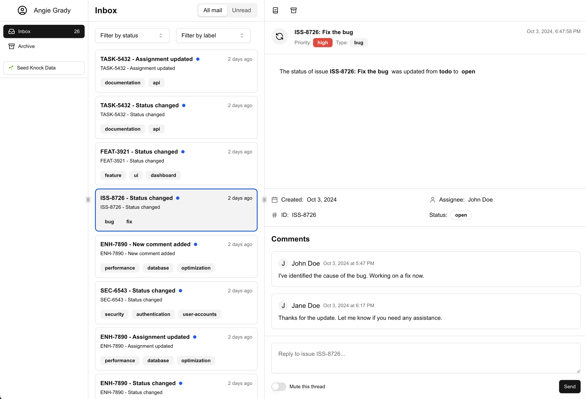

# Creating a custom inbox with Knock

This project demonstrates how to create a custom inbox using Knock's Feed API and React hooks. The app itself is built using Next.js and ShadCN UI.


## Getting started

1. Configure the environment variables:

   Update the `.env.local` file in the root of your project and add the following variables:

   ```
   NEXT_PUBLIC_KNOCK_API_KEY=your_public_knock_api_key
   NEXT_PUBLIC_KNOCK_USER_ID=your_knock_user_id
   NEXT_PUBLIC_KNOCK_FEED_CHANNEL_ID=your_knock_feed_channel_id
   KNOCK_SECRET_API_KEY=your_secret_knock_api_key
   ```

   Replace the values with your actual Knock API credentials. The value for `NEXT_PUBLIC_KNOCK_USER_ID` can be taken from an `account` found in `data.tsx`.

2. Push and commit the Knock workflow:

   Use the [Knock CLI](https://docs.knock.app/cli) to push and commit the `inbox-demo` workflow in the `.knock/inbox-demo` directory:

   ```bash
   knock workflow push .knock/inbox-demo --commit
   ```

3. Install dependencies:

   ```bash
   npm install
   ```

4. Run the development server:

   ```bash
   npm run dev
   ```

5. Open [http://localhost:3000](http://localhost:3000) with your browser to see the result.

## Seeding Knock data

To populate your Knock feed with sample data:

1. Navigate to the home page of the application.
2. Look for the "Seed Knock Data" button in the left-hand navigation.
3. Click the button to trigger the `seedKnockData` server action.

The `seedKnockData` function iterates through each issue in the `issues` array stored in `data.tsx` and triggers the `inbox-demo` workflow for three event types: `statusChange`, `assignment`, and `comment`. Each trigger sends the issue data along with the event type to Knock. This server-side logic is powered by Knock's [server-side Node SDK](https://github.com/knocklabs/knock-node).

```typescript
try {
  await knock.workflows.trigger("inbox-demo", {
    recipients: [
      {
        id: account.id,
        email: account.email,
        name: account.label,
      },
    ],
    actor: {
      id: account.id,
      email: account.email,
      name: account.label,
    },
    data: {
      id: "ENH-7890",
      event: "statusChange",
      title: "ENH-7890: Optimize database queries",
      description:
        "Improve performance by optimizing frequently used database queries",
      date: new Date(Date.now() - 86400000), // Yesterday
      status: "closed",
      previousStatus: "in progress",
      priority: "high",
      type: "enhancement",
      assignee: "David Lee",
      reporter: "Sarah Brown",
      labels: ["performance", "database", "optimization"],
      comments: [
        {
          text: "I've optimized the main query. Seeing a 50% performance improvement.",
          datetime: new Date(Date.now() - 432000000), // 5 days ago
          author: "David Lee",
        },
      ],
    },
  });
  console.log(`Triggered ${eventType} workflow for issue ${issue.id}`);
} catch (error) {
  console.error(
    `Error triggering ${eventType} workflow for issue ${issue.id}:`,
    error
  );
}
```

## Creating a custom inbox using the feed API

This project uses components and hooks from the `@knocklabs/react` package to create a custom inbox view. Here's how these are utilized:

1. `KnockProvider` component:

   In `inbox-provider.tsx`, we wrap our application with the [`KnockProvider`](https://docs.knock.app/sdks/react/reference#knockprovider) to initialize the Knock client:

   ```typescript
   import { KnockProvider } from "@knocklabs/react";

   export function InboxProvider({ children }: InboxProviderProps) {
     return (
       <KnockProvider
         apiKey={process.env.NEXT_PUBLIC_KNOCK_API_KEY || ""}
         userId={process.env.NEXT_PUBLIC_KNOCK_USER_ID || ""}
       >
         {children}
       </KnockProvider>
     );
   }
   ```

   This provider sets up the Knock client with the necessary API key and user ID, making it available to all child components.

2. `useKnockClient` hook:

   ```typescript
   const knockClient = useKnockClient();
   ```

   The [`useKnockClient`](https://docs.knock.app/sdks/react/reference#useknockclient) hook provides access to the Knock client instance for interacting with the Knock API. It's automatically exposed by the `KnockProvider` and can be used to interact with Knock's client-side methods.

3. `useNotifications` hook:

   ```typescript
   const feed = useNotifications(
     knockClient,
     process.env.NEXT_PUBLIC_KNOCK_FEED_CHANNEL_ID || "",
     {
       archived: "include",
     }
   );
   ```

   The [`useNotifications`](https://docs.knock.app/sdks/react/reference#usenotifications) hook fetches and manages notifications for a specific feed channel. It returns a `Feed` object with methods to interact with the notifications.

4. `useNotificationStore` hook:

   ```typescript
   const { items, metadata } = useNotificationStore(feed);
   ```

   The [`useNotificationStore`](https://docs.knock.app/sdks/react/reference#usenotificationstore) hook provides access to notification items and metadata, automatically updating when the feed changes.

5. Fetch notifications on component mount:

   ```typescript
   useEffect(() => {
     feed.fetch();
   }, [feed]);
   ```

   Lastly, we need to perform a `fetch` of the feed to load its initial state. Any realtime updates to the feed are handled automatically by the `useNotificationStore` hook.

### Implementing inbox functionality

Generally, inboxes allow the user to create separate views for their inbox items and offer more advanced filtering and sorting options than feeds. Let's look at how we can implement these features using Knock's built-in messages statues and some custom filtering logic.

- Separate feed items and archived items. This allows us to create separate views for the inbox and archived items:

  ```typescript
  const [feedItems, archivedItems] = useMemo(() => {
    const feedItems = items?.filter((item) => !item.archived_at);
    const archivedItems = items?.filter((item) => item.archived_at);
    return [feedItems, archivedItems];
  }, [items]);
  ```

- Apply additional filtering based on status and label. The `labelFilter` and `statusFilter` variables are used to store the current filter state:

  ```typescript
  const filteredFeedItems = useMemo(() => {
    return feedItems?.filter((item) => {
      const issue = issues.find((i) => i.id === item.data?.id);
      return (
        (statusFilter === undefined ||
          statusFilter === "all" ||
          issue?.status === statusFilter) &&
        (labelFilter === undefined ||
          labelFilter === "all" ||
          issue?.labels.includes(labelFilter))
      );
    });
  }, [feedItems, issues, statusFilter, labelFilter]);
  ```

- Render filtered items in the `MessageList` component:

  ```typescript
  <MessageList items={filteredFeedItems} />
  ```

- Display selected item details in the `MessageDisplay` component. The `message.selected` variable is used to store the currently selected message:
  ```typescript
  <MessageDisplay
    item={items.find((item) => item.id === message.selected) || null}
    feed={feed}
    issues={issues}
  />
  ```

By leveraging these hooks, the component loads and displays notifications from Knock, handles real-time updates, and provides filtering and viewing capabilities for the inbox.

But inboxes often facilitate additional interactions with the messages, such as marking as read/unread, archiving/unarchiving, and even replying to comments. Let's look at how we can implement these features.

### Managing message status with knockClient

In the `MessageDisplay` component, we utilize the `knockClient` through the `feed` prop to manage the status of messages. This includes marking messages as read/unread and archiving/unarchiving them. Here's how it's implemented:

1. Receiving the feed prop:

   The `MessageDisplay` component receives the `feed` object as a prop from its parent component as well as the current selected `item`:

   ```typescript:app/components/message-display.tsx
   export function MessageDisplay({
     item,
     feed,
     issues,
   }: {
     item: FeedItem | null;
     feed: Feed;
     issues: Issue[];
   }) {
     // ... component implementation ...
   }
   ```

   This `feed` object is an instance of the [Knock Feed object](https://docs.knock.app/sdks/javascript/reference#feed), which provides methods for interacting with Knock's Feed API.

2. Marking as Read/Unread:

   ```typescript:app/components/message-display.tsx
   // ... existing code ...

   {!item?.read_at ? (
     <Button
       // ... other props ...
       onClick={() => {
         if (item) {
           feed.markAsRead(item);
         }
       }}
     >
       <BookCheck className="h-4 w-4" />
       <span className="sr-only">Mark as read</span>
     </Button>
   ) : (
     <Button
       // ... other props ...
       onClick={() => {
         if (item) {
           feed.markAsUnread(item);
         }
       }}
     >
       <BookX className="h-4 w-4" />
       <span className="sr-only">Mark as unread</span>
     </Button>
   )}

   // ... existing code ...
   ```

   We use the `feed.markAsRead(item)` and `feed.markAsUnread(item)` methods to toggle the read status of a message.

3. Archiving/Unarchiving:

   ```typescript:app/components/message-display.tsx
   // ... existing code ...

   {!item?.archived_at ? (
     <Button
       // ... other props ...
       onClick={() => {
         if (item) {
           feed.markAsRead(item);
           feed.markAsArchived(item);
         }
       }}
     >
       <Archive className="h-4 w-4" />
       <span className="sr-only">Archive</span>
     </Button>
   ) : (
     <Button
       // ... other props ...
       onClick={() => {
         if (item) {
           feed.markAsUnarchived(item);
         }
       }}
     >
       <Unarchive className="h-4 w-4" />
       <span className="sr-only">Unarchive</span>
     </Button>
   )}

   // ... existing code ...
   ```

   We use the `feed.markAsArchived(item)` and `feed.markAsUnarchived(item)` methods to toggle the archived status of a message. Since Knock's [message engagement statuses](https://docs.knock.app/send-notifications/message-statuses#engagement-status) are mutually inclusive, we mark the message as read when archiving.

### Handling comment replies

The application provides a feature for users to reply to issues directly from the inbox. This functionality shows how you can integrate Knock notifications with your existing systems. Here's how it works:

1. Comment Form:
   In the `MessageDisplay` component, there's a form at the bottom for users to submit comments:

   ```typescript:app/components/message-display.tsx
   <form onSubmit={handleSubmit}>
     <div className="grid gap-4">
       <Textarea
         className="p-4"
         placeholder={`Reply to issue ${item?.data?.id}...`}
         value={comment}
         onChange={(e) => setComment(e.target.value)}
       />
       <div className="flex items-center">
         <Label
           htmlFor="mute"
           className="flex items-center gap-2 text-xs font-normal"
         >
           <Switch id="mute" aria-label="Mute thread" /> Mute this thread
         </Label>
         <Button type="submit" size="sm" className="ml-auto">
           Send
         </Button>
       </div>
     </div>
   </form>
   ```

2. Handling Form Submission:
   When a user submits a comment, the app displays a dialog to simulate sending the comment to your system:

   ```typescript:app/components/message-display.tsx
   const handleSubmit = (e: React.FormEvent) => {
     e.preventDefault();
     setIsDialogOpen(true);
   };
   ```

   ```typescript:app/components/message-display.tsx
   <Dialog open={isDialogOpen} onOpenChange={handleDialogClose}>
     <DialogContent>
       <DialogHeader>
         <DialogTitle>Comment Submitted</DialogTitle>
         <DialogDescription>
           Your comment has been received and needs to be sent to the system
           for Issue #{item?.data?.id}.
         </DialogDescription>
       </DialogHeader>
       <div className="mt-4 p-4 bg-muted rounded-md">
         <p className="text-sm">{comment}</p>
       </div>
       <DialogFooter>
         <Button onClick={handleDialogClose}>Close</Button>
       </DialogFooter>
     </DialogContent>
   </Dialog>
   ```

3. Integration with Your System and Knock:
   In a real-world scenario, submitting a comment would typically involve the following steps:

   - Send the comment to your backend system (e.g., your issue tracking system).
   - Your backend system processes the comment and updates the issue.
   - After successful processing, your backend triggers a Knock workflow.
   - Knock sends out notifications about the new comment to relevant users.

   It's important to note that Knock doesn't actually process or save comments. Instead, Knock's role is to send notifications about new comments to the appropriate users based on the workflows you define.

4. Triggering Knock Workflows:
   After your system processes the comment, you would trigger a Knock workflow similar to how it's done in the `seedKnockData` function:

   ```typescript
   await knock.workflows.trigger("inbox-demo", {
     recipients: [
       // ... recipient details
     ],
     actor: {
       // ... actor details
     },
     data: {
       id: "ENH-7890",
       event: "comment",
       title: "ENH-7890: Optimize database queries",
       // ... other issue details
       comments: [
         {
           text: "New comment text",
           datetime: new Date(),
           author: "Current User",
         },
       ],
     },
   });
   ```

By integrating Knock in this way, you can ensure that all relevant parties are notified about new comments and issue updates in real-time, while maintaining the core data and business logic in your own systems.
